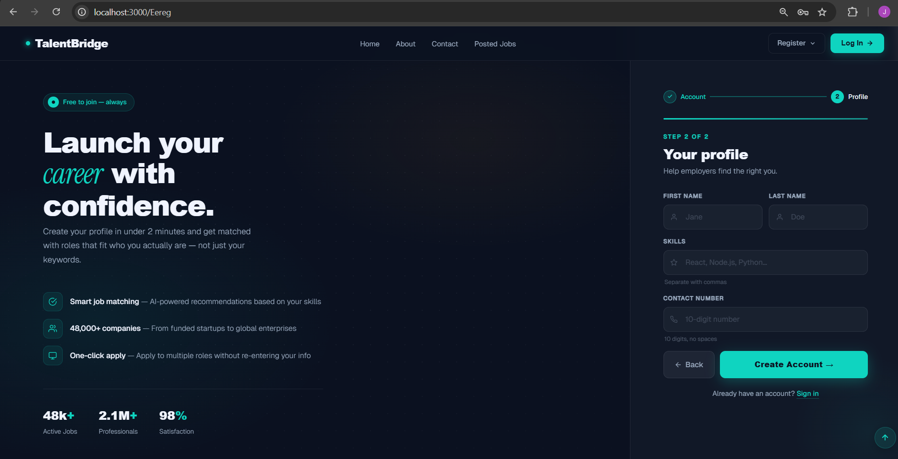

<div align="center">


# 🌉 TalentBridge

### *A Full-Stack Job Application Platform*

**TalentBridge** connects ambitious professionals with companies that actually value what they bring.  
No noise — just the right fit, faster.

[🚀 Live Demo](#installation) · [📸 Screenshots](#-screenshots) · [📖 Docs](#-api-endpoints) · [🤝 Contributing](#-contributing)

---

</div>

## 📋 Table of Contents

- [About the Project](#-about-the-project)
- [Screenshots](#-screenshots)
- [Tech Stack](#-tech-stack)
- [Core Features](#-core-features)
- [Project Structure](#-project-structure)
- [Installation](#-installation)
- [API Endpoints](#-api-endpoints)
- [Learning Outcomes](#-learning-outcomes)
- [Contact](#-contact)

---

## 🎯 About the Project

TalentBridge is a production-grade full-stack job application platform that streamlines the entire hiring lifecycle — from candidate registration and job browsing to one-click applications and employer applicant management.

The platform implements **JWT-based authentication**, **protected REST APIs**, and **role-based access control** for both Job Seekers and Employers.

---

## 📸 Screenshots

### 🔐 Authentication

<table>
  <tr>
    <td align="center"><b>Login Page</b></td>
    <td align="center"><b>Job Seeker Registration</b></td>
  </tr>
  <tr>
    <td></td>
    <td></td>
  </tr>
  <tr>
    <td align="center"><b>Employer Registration</b></td>
    <td align="center"></td>
  </tr>
  <tr>
    <td></td>
    <td></td>
  </tr>
</table>

---

### 🏠 Home Page (Job Seeker View)




---

### ℹ️ About Page

<table>
  <tr>
    <td align="center"><b>Mission Statement</b></td>
    <td align="center"><b>Our Values</b></td>
  </tr>
  <tr>
    <td></td>
    <td></td>
  </tr>
  <tr>
    <td align="center"><b>Join the Community</b></td>
    <td></td>
  </tr>
  <tr>
    <td></td>
    <td></td>
  </tr>
</table>

---

### 📬 Contact Page

<table>
  <tr>
    <td align="center"><b>Contact Info</b></td>
    <td align="center"><b>Contact Form & FAQ</b></td>
  </tr>
  <tr>
    <td></td>
    <td></td>
  </tr>
</table>

---

### 🔍 Job Search & Listings


---

### 📄 Application Tracker (Job Seeker)


---

### 🏢 Employer Dashboard


---

## 🛠 Tech Stack

| Layer | Technology |
|-------|-----------|
| **Frontend** | React.js, Axios, React Router |
| **Backend** | Django, Django REST Framework |
| **Auth** | JWT (SimpleJWT — Access & Refresh Tokens) |
| **Database** | SQLite (Development) |

---

## ✨ Core Features

### 👤 User Roles
- **Job Seeker** — Register, build a profile, browse jobs, apply, track applications
- **Employer** — Register a company, post jobs, view applicants, update application status

### 🔐 Authentication & Security
- JWT-based stateless authentication (Access & Refresh Tokens)
- Protected API endpoints with role-based access control
- Secure password hashing

### 👨‍💻 Job Seeker Features
- Multi-step profile creation (Account → Profile)
- Browse & search jobs by title, skill, or keyword
- Filter by job type (Full Time / Part Time / Internship / Contract) and location
- One-click apply with application status tracking (Applied → Interviewed → Hired)
- Personal dashboard showing all applications with real-time status

### 🏢 Employer Features
- Two-step employer registration (Account → Company)
- Post and manage job listings
- View all applicants per listing
- ATS Rank feature for applicant ranking
- Update applicant status (Applied → Interviewed → Hired / Rejected)

---

## 📂 Project Structure

```
TalentBridge/
│
├── backend/
│   ├── users/             # User registration, login, profiles
│   ├── jobs/              # Job postings CRUD
│   ├── applications/      # Application management
│   ├── manage.py
│   └── requirements.txt
│
├── frontend/
│   ├── src/
│   │   ├── pages/         # Home, About, Contact, Jobs, etc.
│   │   ├── components/    # Reusable UI components
│   │   └── App.js
│   └── package.json
│
└── README.md
```

---

## ⚙️ Installation

### Prerequisites

Make sure you have the following installed:
- [Node.js](https://nodejs.org/)
- [Python 3.x](https://www.python.org/)

### 1️⃣ Clone the Repository

```bash
git clone https://github.com/yourusername/TALENT_BRIDGE.git
cd TALENT_BRIDGE
```

### 2️⃣ Backend Setup

```bash
cd backend

# Create and activate virtual environment
python -m venv venv
source venv/bin/activate        # Windows: venv\Scripts\activate

# Install dependencies
pip install -r requirements.txt

# Apply database migrations
python manage.py migrate

# Start the Django server
python manage.py runserver
```

> Backend runs at: **http://127.0.0.1:8000**

### 3️⃣ Frontend Setup

```bash
cd ../frontend

npm install
npm start
```

> Frontend runs at: **http://localhost:3000**

---

## 📌 API Endpoints

| Method | Endpoint | Description |
|--------|----------|-------------|
| `POST` | `/users/api/register-employer/` | Register Employer |
| `POST` | `/users/api/register-jobseeker/` | Register Job Seeker |
| `POST` | `/users/api/login/` | Login — returns JWT tokens |
| `GET` | `/users/api/profile/<id>/` | Get user profile (protected) |
| `GET` | `/jobs/api/listings/` | List all job postings |
| `POST` | `/jobs/api/listings/` | Create a job posting (employer only) |
| `POST` | `/applications/api/apply/` | Apply for a job |
| `GET` | `/applications/api/my-applications/` | Get applicant's applications |

### 🔎 Example Protected Request

```http
GET /users/api/profile/1/
Authorization: Bearer <access_token>
```

---

## 🧠 Learning Outcomes

- Designed relational database models for multi-role user systems
- Implemented JWT-based stateless authentication with refresh token rotation
- Built secure REST APIs with Django REST Framework
- Integrated React.js frontend with Django backend via Axios
- Implemented role-based access control (Job Seeker vs. Employer)
- Built a real-time application status tracking pipeline

---

## 🤝 Contributing

Contributions are welcome! Here's how to get started:

1. Fork the repository
2. Create your feature branch: `git checkout -b feature/AmazingFeature`
3. Commit your changes: `git commit -m 'Add some AmazingFeature'`
4. Push to the branch: `git push origin feature/AmazingFeature`
5. Open a Pull Request

---

## 📬 Contact

**Jainam Shah**

[](mailto:jainamshah898@gmail.com)
[](tel:6354592403)

---

<div align="center">

Made with ❤️ by Jainam Shah

⭐ **Star this repo if you found it helpful!**

</div>
